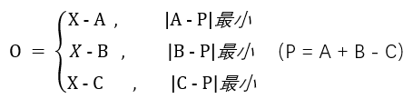

# 过滤与还原
## 一、过滤
过滤（filter）是将图片信息变得容易压缩的过程，整张图片只会使用一种`过滤方法`（method）（包括多种`过滤类型`），而`过滤类型`会被插到每个扫描行的前面，以方便压缩。目前 PNG 图片指定的过滤方式只有一种（method 0），所以实际使用时，只需要指定`过滤类型`。`过滤类型`指的是像素基于`相邻像素`的变化规律，通过这个变化规律即可推断出某像素的`预测值`，实际储存的是`实际值`与`预测值`之间的差值（残差，通常较小），为了便于描述，规定了`相邻像素`相对`当前像素`的方位：左（A）、上（B）、左上（C）。
|C|B|
|--|--|
|A|X|

对 method 0 来说，，共有 5 种：
|过滤类型|存储值(O)=实际值(X)-预测值(R)|
|-|-|
|0|O = X|
|1|O = x - A|
|2|O = X - B|
|3|O = X - (A+B)/2|
|4||

> 由于过滤对左、左上、上方的数据有依赖，要保证左上方数据尚未被过滤，所以需要从待过滤数据的右下角开始进行。

## 二、还原
png解码的两个关键步骤分别是解压与还原像素信息，解压后的data是一串绝对值较小的数据，而还原就是通过依靠其中的几个未过滤数据以及已知的过滤方法推导出其他数据的过程。即通过O 与 R 的值计算 A 的值，是过滤的逆过程。
> 由于还原对左、左上、上方的数据有依赖，要保证左上方数据首先被还原，所以需要从待还原数据的左上角开始进行。
